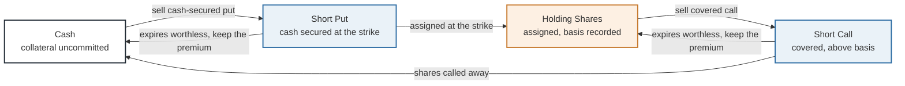
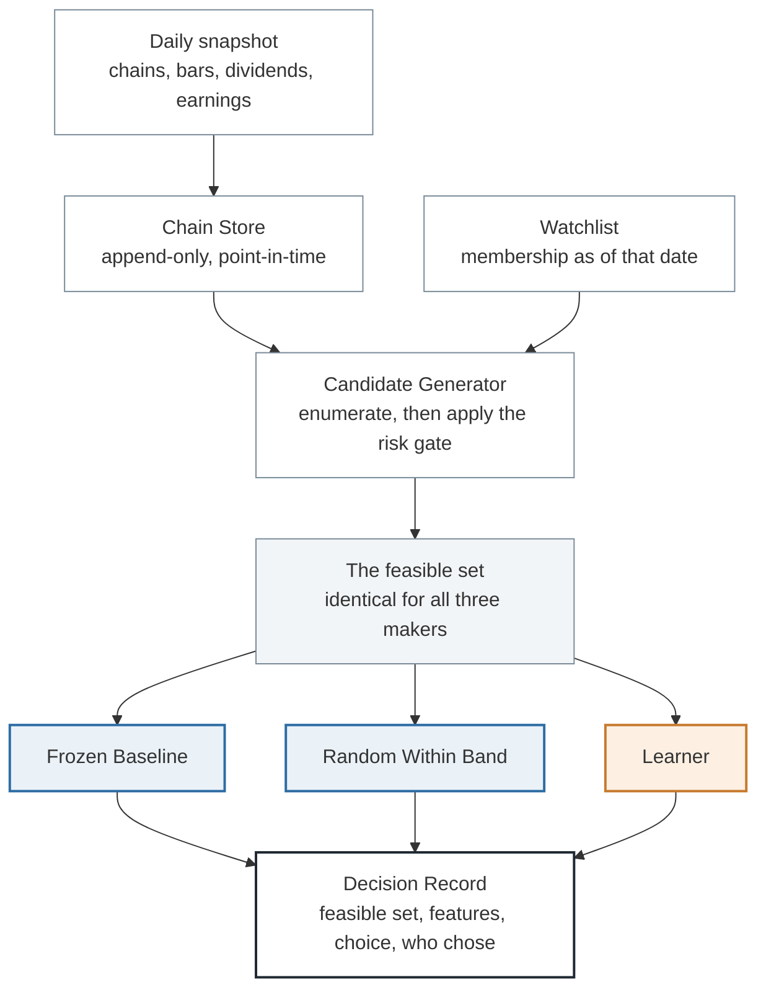
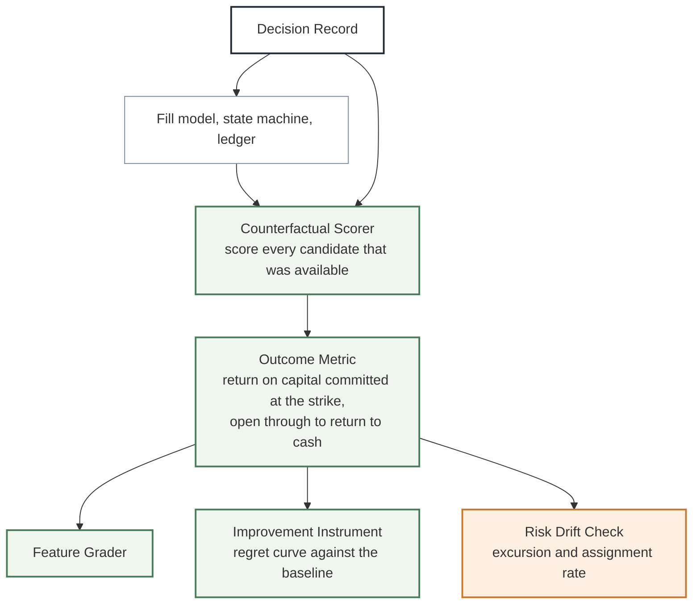

# ORIENTATION

Plain language. Read this start to finish. No decision numbers inside the
pictures, and one job per picture.

Build state for this whole document: describes a design that is **not yet built**.
Nothing here has shipped.

This document assumes you know what a put, a call, a strike, and assignment are,
and roughly how the wheel behaves. If any of that is unfamiliar, read
`PRIMER_THE_WHEEL.md` first and keep `GLOSSARY.md` beside you. Neither is long.

## What the lab is trying to find out

Most trading research asks whether a rule makes money. This lab asks something
different and narrower: does a decision-maker get better at deciding, over time,
from evidence it has accumulated itself.

That question is worth asking because it does not depend on markets being
beatable. If no wheel configuration ever beats holding the same shares, the lab
still has an answer, because the thing being measured is the improvement, not the
profit. It also means the lab cannot be quietly rescued by a good year, since a
rising market lifts every decision-maker equally and the measurement is a
comparison between them.

## Why the wheel, of all things

The wheel was chosen as the task environment because of one property that most
strategies do not have.

On any given day, for any name on the watchlist, there are perhaps two hundred
option contracts you could sell. You pick one. After expiry, you can compute what
would have happened with every single one of the others, because they were all
priced and all recorded. The road not taken is fully observable.

That is unusual. In an equities research lab you cannot see what a rejected
proposal would have done without waiting years for a comparable one. Here the
entire opportunity set resolves in about six weeks, which means every decision
comes with a rank and a regret against the alternatives that were genuinely
available at the time.

A dense grid of counterfactuals is exactly what you need to measure whether
decisions are improving. It is also exactly the environment in which a learner
will happily overfit, which is why half the machinery in this lab exists to catch
that.

## The wheel itself

Four states, and one trial runs from cash back to cash.

Static version: `diagrams/wheel-state-machine.svg`

Assignment is not a failure. It is a designed leg of the loop, and the lab only
sells puts on names it would accept owning. That restriction is the single
largest risk control in the design, and it is structural rather than learned.

## How a day works

Three decision-makers act every day on the same data, with the same fill rules,
keeping separate ledgers. The frozen baseline never changes and is the yardstick
that the learner has to beat. The random maker picks at random within the same
delta and expiry bands, which separates "the selection rule adds something" from
"being short volatility pays".

The risk gate sits inside the candidate generator rather than after the choice.
That matters more than it looks. If the gate filtered afterwards, the three
makers would face different effective opportunity sets and any difference between
them would partly be permission rather than judgement. Gating first means all
three choose from the same feasible set, so a difference is selection.

## How a decision gets judged

Static version, showing the whole system on one page including the learning
return path: `diagrams/architecture.svg`

The outcome of a decision is measured on the capital it actually tied up, from
the moment the position opened until the money came back to cash. Assignment is
inside that number rather than treated as an exit, which is the difference
between a lab that can see its own downside and one that cannot.

Alongside every outcome the lab records the worst the position ever got during
its life, not just where it ended. A put that expired worthless after spending
three weeks deep in the money took real risk, and scoring only the endpoint would
credit that decision identically to one that was never threatened.

## The firewall

Nothing the learner produces may reach anything that judges the learner. Not the
scorer, not the feature grades, not the improvement instrument, not the risk drift
check, and not the risk caps.

That last one is worth saying plainly, because it is the exception that looks
arbitrary until you see why. The learner may propose new policy rows. It may not
propose changes to the concentration caps or the committed-capital limits. The
reason is that the available data almost certainly contains no crash, so any
conclusion the learner forms about tail risk is an estimate drawn from a sample
that lacks the tail. A learner reasoning from a calm two years will conclude the
caps are too conservative, and it will be wrong in a way the data cannot show it.

Risk that the sample cannot price has to be controlled by structure.

## What would tell you the lab is failing

Two things, and they are different.

The lab is not working if the learner's regret curve does not fall relative to
the frozen baseline. That is the plain negative result, and it is a legitimate
answer rather than a failure of the lab.

The lab is deceiving itself if regret falls while adverse excursion widens,
assignment rate climbs, or committed capital creeps up. That is not improvement,
it is borrowing from the tail, and it is the specific way this design would fool
its owner. The risk drift check exists to catch precisely that pattern and is
compared against the frozen baseline as a standing test.

`VALIDITY.md` states both cases as pre-registered criteria.
